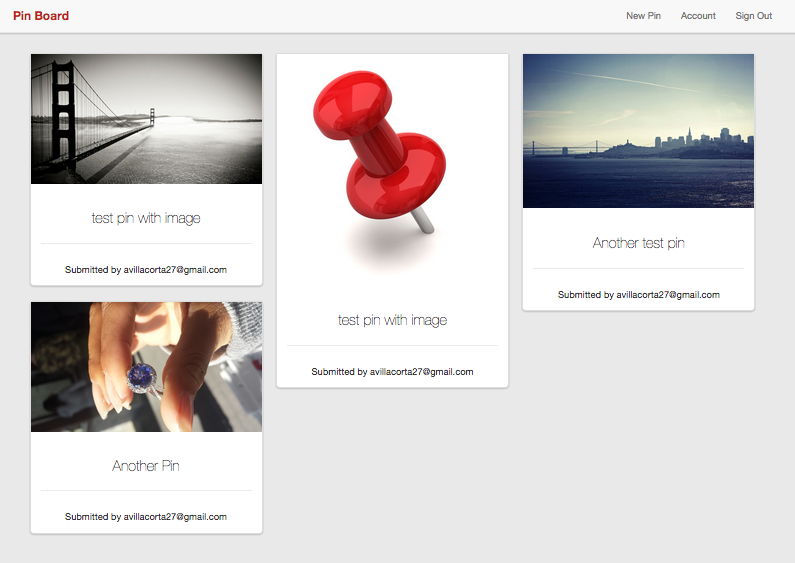
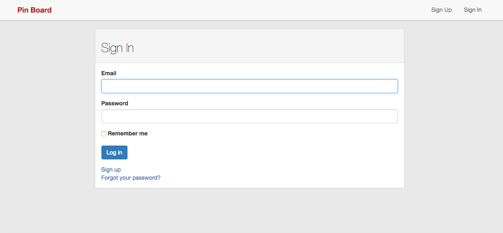
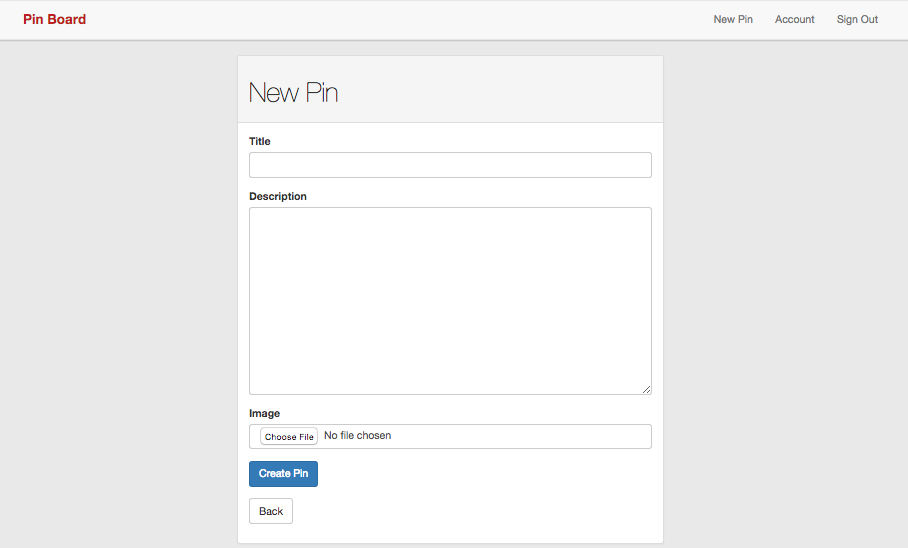
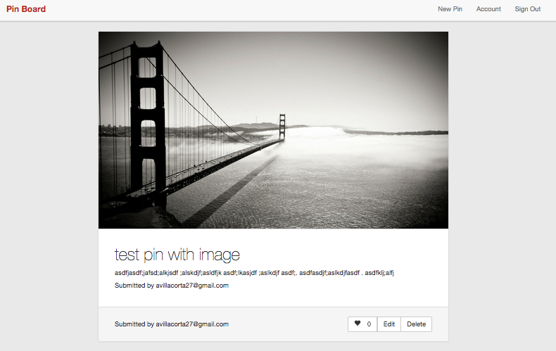

#README

###This is a Pinterest Clone that I built to practice implementing devise and some other handy gems such as acts_as_votable.  A full list can be seen in the gem file.

**A User can view all the submitted pins.**

**A User Can Sign in/up via Devise.**

**A user Can Submit a pin.**

**A user can view and like on indivual pins as well.**

